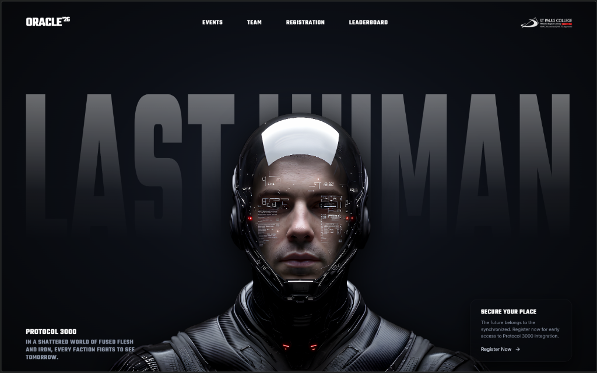

# ORACLE '26 — Sector 00 / Protocol 3000

Official college fest management & scoring platform built for **ORACLE '26** (St Pauls College / SPC-Pegasus).

---

## Features

- **Cybernetic Sci-Fi UI**: Custom interactive animations, gooey navigation bar, and canvas spark effects.
- **Event Catalog**: Live details, guidelines, and schedules for college events.
- **Team & Participant Registrations**: Public registration portal for competing teams.
- **Live Leaderboard**: Real-time scoring and standings display.
- **Authenticated Admin Portal**: Secured backend endpoints protected by API keys and IP rate limiting for live score updates.
- **Serverless & Node.js Ready**: Dual-support for standard Express deployments and Netlify Functions.

---

## Tech Stack

- **Backend**: Node.js, Express, MongoDB (Mongoose), Netlify Functions
- **Frontend**: Vanilla HTML5, CSS3, JavaScript, Canvas API
- **Security**: Rate limiting, API key authentication, CORS configuration
